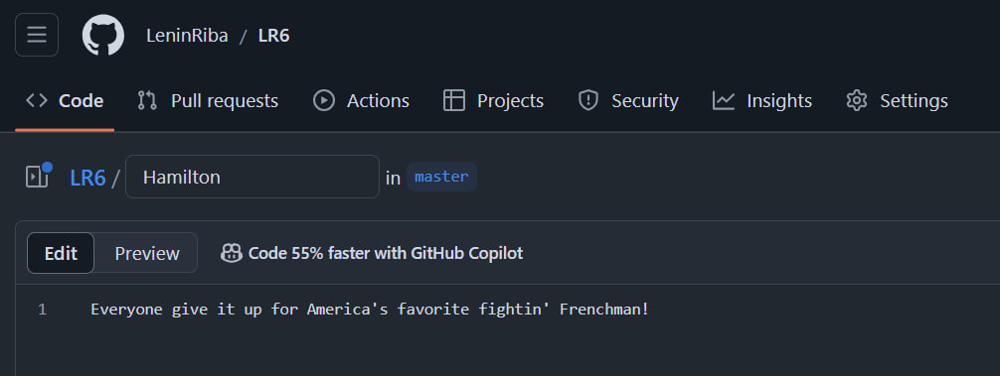

# Лабораторная работа №6
## Система контроля версий 

**Цель лабораторной работы**: изучение базовых возможностей системы управления версиями, опыт работы с Git Api, опыт работы с локальным и удаленным репозиторием.

## 1. Создание форка
Создана копия в личное хранилище из https://github.com/Kurtyanik/LR6/


## 2. Установка Git
Установка


## 3. Изменение имени и почты пользователя
Команда для изменения имени пользователя:

```bash
$ git config --global user.name "Группа 4317 Шахова А.Г."
```
Команда для изменения почты пользователя:

```bash
$ git config --global user.email "a.shakhova.gn@gmail.com"
```


## 4. Клонирование репозитория

```bash
$ git clone https://github.com/LeninRiba/LR6
```

## 5. Добавление нового файла



## 6. Добавление изменений в локальный репозиторий

```bash
$ git pull
```

## 7. Получение данных для каждой из веток

```bash
$ git log --all --oneline
```

*Результат работы команды*


## 8. Просмотр последних изменений

```bash
$ git log -1
```

*Результат работы команды*


## 9. Решение конфликта и слияние веток

```bash
$ git checkout master
$ git merge branch1
```
Решение конфликта путем замены содержимого файла mergefile.txt в ветке branch1

## 10. Удаление побочной ветки после слияния

```bash
$ git branch -d branch1
```


## 11. Сделать изменения и зафиксировать их, оставляя комментарии, несколько раз.
Создание файлов


Комментарии к файлам


## 12. Откат коммита
Откат к предыдущему коммиту:

```bash
$ git revert 10e7b0c
```


## 12. Создание ветки для отчета

```bash
$ git checkout -b report
```

## 13. Получение истории операций в форматированном виде

```bash
$ git log --pretty=format:"%h %ad %an %s" --date=short
```


## 14. Лог команд

```bash
$ git config --global user.name 
$ git config --global user.email
$ git clone
$ git pull
$ git log --all --oneline
$ git log -1
$ git checkout master
$ git merge branch1
$ git branch -d branch1
$ git revert
$ git checkout -b report
$ git log --pretty=format:"%h %ad %an %s" --date=short
```
